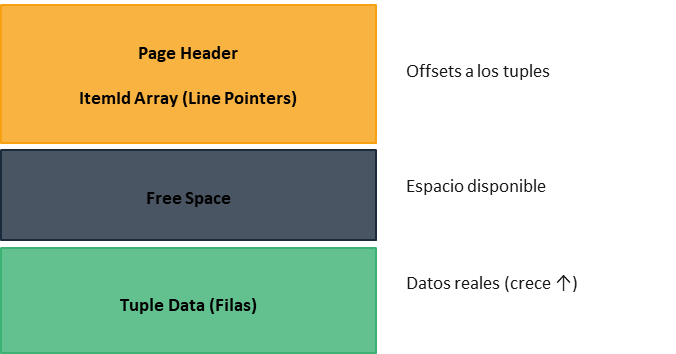

<div style="background: #86d1f1ff; border-radius: 5px; padding: 1rem; margin-bottom: 1rem">
   
 <div style="font-weight: bold; color: #434549ff; float: right "><u style="font-size: 28px;">Base de Datos II</u> <br />
<span style="float:right"> Profesor Percy Lovon</span> <br /> 
<span style="float:right">  2026 - 2 </span>   
 </div>
 </div>
 
 # Laboratorio 02: Heap File con Registros de Longitud Fija y Variable

## Objetivo del Laboratorio

Implementar **Heap Files** para el manejo de registros de longitud fija y variable en archivos de base de datos. Los estudiantes aprenderán estrategias de organización en páginas, gestión del espacio libre y técnicas de eliminación (MOVE THE LAST, FREE LIST, SlottedPage) fundamentales en sistemas de almacenamiento eficiente.

## Estructura de Páginas

En ambos ejercicios los registros deben organizarse en páginas, ver siguiente imagen de la estructura de una página:

 

 ## P1 (10 pts): Registros de Longitud Fija

Dada la siguiente estructura del registro de longitud fija:

```bash
Registro Alumno:
    Atributos:
        codigo (Cadena[5])       # Tamaño: 5 caracteres
        nombre (Cadena[11])      # Tamaño: 11 caracteres
        apellidos (Cadena[20])   # Tamaño: 20 caracteres
        carrera (Cadena[15])     # Tamaño: 15 caracteres
        ciclo (Entero)           # Entero para el ciclo
        mensualidad (Decimal)    # Decimal para la mensualidad
```

### Header de Página:
Para registros de longitud fija, el **header de cada página** debe contener:
- **Número total de registros** en la página
- **Número de registros activos** (no eliminados)
- **Puntero al primer espacio eliminado** (para FREE LIST strategy)

### Requisitos:

Se le pide implementar una clase llamada `FixedRecord` que encapsule las operaciones de manipulación de archivo binario con dos estrategias de eliminación:

1. **El constructor** debe recibir el nombre del archivo y el modo de eliminación:
   - **MOVE THE LAST**: mueve el último registro a la posición del registro eliminado.
   - **FREE LIST**: mantiene una lista de espacios libres para ser usados en nuevas inserciones.
   - Puede separar la implementación en dos clases, una para cada modo de eliminación.

2. **Implementar las siguientes funciones:**
   - `load()`: devuelve todos los registros válidos del archivo.
   - `add(record)`: agrega un nuevo registro al archivo O(1). Debe considerar los espacios libres.
   - `readRecord(pos)`: obtiene el registro de la posición "pos" O(1). Debe validar si el registro ha sido eliminado.
   - `remove(pos)`: elimina el registro de la posición "pos" O(1).

3. **Realizar pruebas funcionales** de cada método (`P1.py`).
   - Generar **N registros** (mínimo 100) para las pruebas funcionales.


## P2 (10 pts): Registros de Longitud Variable

Dada la siguiente estructura del registro de longitud variable:
```bash
Registro Matricula:
    Atributos:
        codigo (Cadena*)        # Tamaño variable
        ciclo (Entero)          # Entero para el ciclo
        mensualidad (Decimal)   # Decimal para la mensualidad
        observaciones (Cadena*) # Tamaño variable
```

### Header de Página:
Para registros de longitud variable con **SlottedPage**, el **header de cada página** debe contener:
- **Número de slots** utilizados
- **Puntero al espacio libre** (free space pointer)
- **Directory de slots**: array de pares (offset, length) para cada registro

### Requisitos:

Se le pide implementar un programa para leer y escribir registros de longitud variable en un archivo binario usando **SlottedPage**:

1. **Usar SlottedPage strategy** para manejar registros de longitud variable dentro de cada página.
   
2. **Implementar las siguientes funciones:**
   - `load()`: devuelve todos los registros del archivo.
   - `add(record)`: agrega un nuevo registro al archivo O(1).
   - `readRecord(pos)`: obtiene el registro de la posición "pos" O(1).
   - `remove(pos)`: elimina el registro de la posición "pos". Debe incluir una estrategia de **compactación** del espacio libre en la página para evitar fragmentación, asegurando que los IDs de los slots originales no se alteren.

3. **Realizar las pruebas funcionales** de cada método (`P2.cpp`).
   - Generar **N registros** (mínimo 100) para las pruebas funcionales.
   - Demostrar que la compactación funciona correctamente tras realizar múltiples eliminaciones.

## P3 (Reto Adicional): FillFactor

Implementar soporte para un **FillFactor** configurable (ej. 80%) a nivel de página. Al insertar nuevos registros, las páginas solo deben llenarse hasta alcanzar este porcentaje de ocupación máxima teórica, dejando el espacio libre restante como reserva para futuras operaciones.

## Entregable

### Archivos a entregar:
- **P1.py** - Ejercicio 1 resuelto en Python (módulo struct)
- **P2.cpp** - Ejercicio 2 resuelto en C++ 17
- **Archivos de datos** utilizados durante las pruebas

### Criterios de evaluación para cada pregunta:
- **Funcionamiento correcto** (60%): Operaciones CRUD completas, estrategias de eliminación funcionales (MOVE THE LAST, FREE LIST, SlottedPage)
- **Gestión de páginas** (25%): Headers implementados correctamente, paginación funcional según especificaciones
- **Calidad del código** (10%): Código documentado, compilación exitosa, compatibilidad de lectura 
- **Pruebas y validación** (5%): Generación mínimo 100 registros, casos de borde cubiertos
