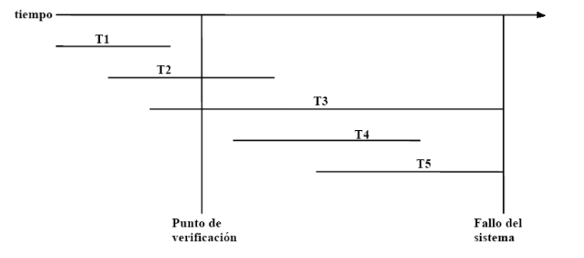

<div style="background: #86d1f1ff; border-radius: 5px; padding: 1rem; margin-bottom: 1rem">
   
<div style="font-weight: bold; color: #434549ff; float: right "><u style="font-size: 28px;">Base de Datos II</u> <br />
<span style="float:right"> Profesor Percy Lovon</span> <br /> 
<span style="float:right">  2026 - 2 </span>   
</div> </div>

 # Laboratorio 06: Control de Concurrencia & DataBase Recovery

 ## P1. Detección de problemas concurrentes

Analizar los siguientes planes de transacciones y deducir que problema de concurrencia puede ocurrir: actualización perdida, dependencia no confirmada (lectura sucia) y lectura no repetible. Mostrar los valores del recurso compartido en cada instante de tiempo. Resalte claramente en donde se produce el problema de concurrencia.

| T1          | T2          | X=100 |
|-------------|-------------|-------|
| READ(X)     |             |       |
| SHOW(X)     |             |       |
| X = X + 50  |             |       |
|             | READ(X)     |       |
|             | X = X - 30  |       |
| WRITE(X)    |             |       |
| READ(X)     |             |       |
|             | WRITE(X)    |       |
|             | SHOW(X)     |       |
| READ(X)     |             |       |
| SHOW(X)     |             |       |

<br>

| T1(N=15)   | T2(M=5)    | T3(J=10)   | Y=200  |
|------------|------------|------------|--------|
| READ(Y)    |            |            |        |
| Y = Y - N  |            |            |        |
|            | READ(Y)    |            |        |
|            | Y = Y + M  |            |        |
| WRITE(Y)   |            |            |        |
|            | WRITE(Y)   |            |        |
|            |            | READ(Y)    |        |
|            |            | Y = Y * J  |        |
|            |            | WRITE(Y)   |        |
| COMMIT     |            |            |        |
|            | ROLLBACK   |            |        |

<br>

| T1(N=5)           | T2(M=3)            | X=100 |
|-------------------|--------------------|-------|
| READ(X)           |                    |       |
| X=X-N             |                    |       |
| WRITE(X)          |                    |       |
|                   | READ(X)            |       |
|                   | X=X+M              |       |
| READ(Y)           |                    |       |
|                   | WRITE(X)           |       |
|                   | COMMIT             |       |
| ROLLBACK          |                    |       |

<br>

## P2. Detección de problemas concurrentes

Analice el siguiente plan de ejecución de transacciones, ¿Qué problema se presenta si se tiene que mantener la **restricción A=B** al finalizar la ejecución del plan? ¿Qué modificación haría a dicho plan concurrente para garantizar la restricción?

| T1               | T2               | A=100, B=100 |
|------------------|------------------|--------------|
| READ(A)          |                  |              |
| A = A+1          |                  |              |
| WRITE(A)         |                  |              |
|                  | READ(A)          |              |
|                  | A = 2*A          |              |
|                  | WRITE(A)         |              |
| READ(B)          |                  |              |
| B = B+1          |                  |              |
| WRITE(B)         |                  |              |
|                  | READ(B)          |              |
|                  | B = 2*B          |              |
|                  | WRITE(B)         |              |


## P3. Grafo de Precedencia

Dada los siguientes planes de transacciones indique usted si corresponde a una planificación serializable por conflictos usando el grafo de precedencia. Caso de no ser serializable, permute las instrucciones para obtener un plan serializable (si es factible) y muestre el plan secuencial equivalente.

| T1                 | T2                  | T3                 |
|--------------------|---------------------|--------------------|
|                    | READ(Z)             |                    |
| READ(Y)            |                     |                    |
| WRITE(Y)           |                     |                    |
|                    | READ(Y)             |                    |
|                    |                     | READ(Z)            |
| READ(X)            |                     |                    |
| WRITE(X)           |                     |                    |
|                    | WRITE(Y)            |                    |
|                    |                     | WRITE(Z)           |
|                    | READ(X)             |                    |
|                    |                     | READ(X)            |
|                    |                     | WRITE(X)           |
|                    | WRITE(X)            |                    |

<br>

| T1                 | T2                  | T3                 |
|--------------------|---------------------|--------------------|
|                    | READ(Z)             |                    |
|                    | READ(Y)             |                    |
|                    | WRITE(Y)            |                    |
|                    |                     | READ(Y)            |
|                    |                     | READ(Z)            |
| READ(X)            |                     |                    |
| WRITE(X)           |                     |                    |
|                    |                     | WRITE(Y)           |
|                    | WRITE(Z)            |                    |
|                    | READ(X)             |                    |
| READ(Y)            |                     |                    |
| WRITE(Y)           |                     |                    |
|                    | WRITE(X)            |                    |


## P4.  Algoritmos

**a)** Diseñe el algoritmo para verificar si una planificación es serializable por conflicto. Considere los tres pasos generales.


**b)** Diseñe el algoritmo de bloqueo para el protocolo de actualización


**c)** Diseñe el algoritmo de desbloqueo considerando el protocolo de actualización


## P5.  DB Recovery 1

Considere que el proceso de recuperación de bases de datos utiliza puntos de verificación (checkpoints). Aplique el algoritmo de recuperación e indique cuáles de las siguientes transacciones deben deshacerse (UNDO) y cuáles volver a ejecutarse (REDO) ante una falla del sistema.


<div style="text-align: center;">
  
  <br>
</div>


## P6. DB Recovery 2

Considere el siguiente registro del log de transacciones:

```plaintext
<T1, BT>
<T1, A, 10, 15>  // Update A con 15.
<T1, B, 20, 15>  // Update B con 15.
<T2, BT>
<T2, C, 11, 12>  // Update C con 12.
<T1, D, 17, 18>  // Update D con 18.
<T2, COMMIT>
<CHECKPOINT>
<T1, COMMIT>
<T3, BT>
<T3, A, 15, 12>  // Update A con 12.
<T3, B, 15, 12>  // Update B con 12.
<T4, BT>
<T4, C, 12, 22>  // Update C con 22.
<T4, COMMIT>
Falla del sistema
```

**a)**   Genere un gráfico temporal de ejecución de las transacciones, con referencia al tiempo de checkpoint y al momento de la falla.


**b)** Aplique el algoritmo de recuperación e indique la acción que se realiza con cada una de las transacciones involucradas en el proceso de recuperación de la falla, según las diferentes estrategias de modificación: diferida e inmediata. 

**¿Cuáles son valores finales de los recursos de la BD?**

## P7. DB Recovery 3

A partir del siguiente esquema de ejecución:

```plaintext
T3: read(Z); T3: read(W); T2: read(X); T3: Z=Z+W; T3: write(Z); T3: commit; T2: read(Z); T1: read(X); T2: Z= Z*X; T2: abort; T1: X=X+10; T1: write(X); FALLA

```

**a)** Indique la secuencia de registros que se graban en el LOG, considerando que los valores de ítems son originalmente **X=30, W=20** y **Z=50.**

**b)** Aplique el proceso de recuperación, utilizando la estrategia **UNDO/REDO.**
