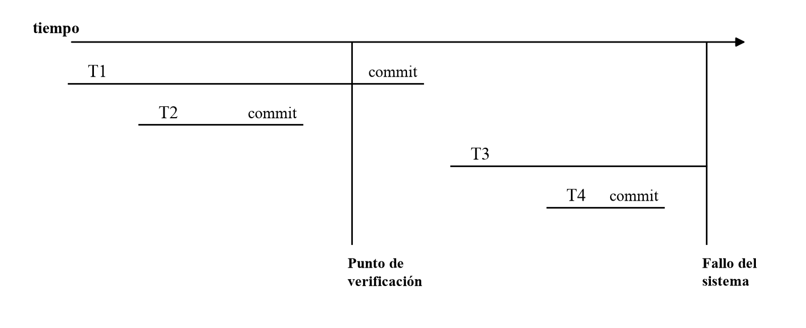

<div style="background: #86d1f1ff; border-radius: 5px; padding: 1rem; margin-bottom: 1rem">

<div style="font-weight: bold; color: #434549ff; float: right "><u style="font-size: 28px;">Base de Datos II</u> <br />
<span style="float:right"> Profesor Percy Lovon</span> <br />
<span style="float:right">  2026 - 2 </span>
</div> </div>

# Laboratorio 06 — Solución P4 a P7

> Notación tomada de la sesión *06 Recuperación ante Fallos*:
> `BLOCK(X) = 0` libre, `= 1` compartido (PS), `= 2` exclusivo (PX). Se añade `= 3`
> para el bloqueo de actualización (PU). Registros de log `<Ti, BT>`,
> `<Ti, X, IA, ID>`, `<Ti, COMMIT>`, `<Ti, ABORT>`, `<CP, L>`.

---

## P4. Algoritmos

### a) Verificar si una planificación es serializable por conflicto

La clase define **tres pasos generales** (slide *Planificación Serializable: Pasos Generales*):

1. Crear el grafo de precedencia a partir de la planificación concurrente.
2. Verificar si el grafo arma al menos un ciclo.
3. Si no hay ciclos, indicar al menos una planificación secuencial equivalente.

**Reglas de conflicto** (slide *Algoritmo para crear el grafo de precedencia*) — dos
operaciones entran en conflicto si son de **transacciones distintas**, sobre el
**mismo ítem** y **al menos una es WRITE**:

| `o_i` (antes) | `o_j` (después) | Arista |
|---|---|---|
| `Ti: WRITE(X)` | `Tj: READ(X)`  | `Ti → Tj` |
| `Ti: READ(X)`  | `Tj: WRITE(X)` | `Ti → Tj` |
| `Ti: WRITE(X)` | `Tj: WRITE(X)` | `Ti → Tj` |
| `Ti: READ(X)`  | `Tj: READ(X)`  | — (no hay conflicto) |

```text
ALGORITMO EsSerializablePorConflicto(S)
Data  : S = <o1, o2, ..., on>, la secuencia cronológica de operaciones del plan,
        con oi = (trans(oi), accion(oi), item(oi))
Result: (TRUE, plan secuencial equivalente)  ó  (FALSE, existe ciclo)

// ---------- PASO 1: construir el grafo de precedencia G = (V, E) ----------
V <- { Ti : Ti aparece en S }
E <- {}
for i <- 1 to n-1 do
    for j <- i+1 to n do
        if item(oi) = item(oj) and trans(oi) != trans(oj) then
            if accion(oi) = WRITE or accion(oj) = WRITE then
                E <- E U { (trans(oi) -> trans(oj)) etiquetada con item(oi) }
            end                       // READ-READ no genera arista
        end
    end
end

// ---------- PASO 2: detección de ciclo (Kahn / orden topológico) ----------
for each v in V do  gradoEnt[v] <- #{ u : (u -> v) in E }  end
Q <- cola con todo v in V tal que gradoEnt[v] = 0
L <- []                                // lista de salida = orden serial
while Q != vacia do
    u <- extraer(Q)
    L.append(u)
    for each arista (u -> v) in E do
        gradoEnt[v] <- gradoEnt[v] - 1
        if gradoEnt[v] = 0 then Q.push(v) end
    end
end

// ---------- PASO 3: conclusión ----------
if |L| < |V| then
    return (FALSE, "hay un ciclo => el plan NO es serializable por conflictos")
else
    return (TRUE, L)                   // L es una planificación secuencial equivalente
end
```

**Lectura del resultado.** Si `|L| < |V|` quedaron nodos con grado de entrada > 0
que nunca llegaron a 0: eso es exactamente un ciclo (caso del *Ejemplo 1* de clase,
`T1 → T2 → T3 → T1`). Si el bucle vacía `V`, `L` es un orden topológico y el plan
secuencial `T_{L[1]}; T_{L[2]}; …` es conflicto-equivalente al original (caso del
*Ejemplo 2*: `T2; T1; T3`).

**Costo.** El paso 1 es `O(n²)`; se baja a `O(n · |V|)` si por cada ítem `X` se
mantiene el último escritor `last_write(X)` y el conjunto de lectores desde esa
escritura `readers(X)`, y se generan aristas sólo contra ellos. El paso 2 es
`O(|V| + |E|)`. Como alternativa al paso 2 se puede usar DFS con marcado
blanco/gris/negro: una arista hacia un nodo **gris** es un ciclo.

---

### b) Algoritmo de bloqueo para el protocolo de actualización (PU)

**Motivación** (slide del interbloqueo): con PS + PX, si `T1` y `T2` toman ambas
`SREAD(R)` y luego ambas piden `XWRITE(R)`, cada una espera que la otra suelte su
bloqueo compartido → **deadlock**. El PU lo evita permitiendo **un solo** bloqueo de
actualización por ítem: sólo esa transacción puede promover a exclusivo.

**Matriz de compatibilidad:**

|  | S (1) | U (3) | X (2) |
|---|---|---|---|
| **S (1)** | ✔ | ✔ | ✘ |
| **U (3)** | ✔ | ✘ | ✘ |
| **X (2)** | ✘ | ✘ | ✘ |

Estado por ítem: `BLOCK(X) ∈ {0,1,2,3}`, `num_read` (lectores actuales, incluido el
poseedor del U) y `U_owner` (quién tiene el bloqueo de actualización).

```text
ALGORITMO Bloquear(X, Ti, modo)            // modo in {S, U, EX}
Data  : elemento X de la base de datos, transacción Ti, modo solicitado
Result: actualización de BLOCK(X), num_read y U_owner

B: switch modo do

   case S:                                  // SREAD(X)  -- compatible con 0, 1 y 3
       if BLOCK(X) = 0 then
           BLOCK(X) <- 1;   num_read <- 1;
       else if BLOCK(X) = 1 or BLOCK(X) = 3 then
           num_read <- num_read + 1;        // se suma como lector; el estado no cambia
       else                                 // BLOCK(X) = 2
           wait(until BLOCK(X) = 0 and DBMS wakes up the transaction);
           go to B;
       end

   case U:                                  // UREAD(X)  -- compatible sólo con 0 y 1
       if BLOCK(X) = 0 then
           BLOCK(X) <- 3;   U_owner <- Ti;   num_read <- 1;
       else if BLOCK(X) = 1 then            // conviven lectores S con un único U
           BLOCK(X) <- 3;   U_owner <- Ti;   num_read <- num_read + 1;
       else                                 // 2 (exclusivo) ó 3 (ya hay otro U)
           wait(en la COLA DE ESPERA DE BLOQUEO DE ACTUALIZACIÓN,
                until BLOCK(X) in {0,1} and DBMS wakes up the transaction);
           go to B;
       end

   case EX:                                 // XWRITE(X)
       if BLOCK(X) = 0 then
           BLOCK(X) <- 2;                   // bloqueo exclusivo directo (PX)
       else if BLOCK(X) = 3 and U_owner = Ti then
           // ---- PROMOCIÓN U -> X: sólo la dueña del U puede llegar aquí ----
           if num_read = 1 then             // Ti es el único lector que queda
               BLOCK(X) <- 2;   num_read <- 0;   U_owner <- NULL;
           else
               wait(until num_read = 1 and DBMS wakes up the transaction);
               go to B;                     // espera que salgan los lectores S
           end
       else                                 // 1, 2, ó 3 de otra transacción
           wait(en la COLA DE ESPERA DE BLOQUEO EXCLUSIVO,
                until BLOCK(X) = 0 and DBMS wakes up the transaction);
           go to B;
       end
end
```

**Por qué elimina el interbloqueo del slide.** La rama `case U` sólo deja pasar a
**una** transacción (las demás quedan en la cola de actualización), de modo que la
promoción `U → X` nunca se cruza con otra promoción simétrica: la espera de
`num_read = 1` siempre termina porque los lectores S no pueden promover.

---

### c) Algoritmo de desbloqueo considerando PU

```text
ALGORITMO Desbloquear(X, Ti)
Data  : elemento X de la base de datos, transacción Ti que libera
Result: actualización de BLOCK(X), num_read y U_owner

B: if BLOCK(X) = 2 then                     // ---- exclusivo ----
       BLOCK(X) <- 0;   num_read <- 0;   U_owner <- NULL;
       Wake up the waiting transactions;    // cola U -> cola X -> cola S

   else if BLOCK(X) = 3 then                // ---- actualización ----
       num_read <- num_read - 1;
       if U_owner = Ti then                 // libera la dueña del bloqueo U
           U_owner <- NULL;
           if num_read = 0 then  BLOCK(X) <- 0;
           else                  BLOCK(X) <- 1;   // quedan sólo lectores compartidos
           end
           Wake up the waiting transactions;
       else                                 // libera un lector S que convivía con el U
           if num_read = 1 then
               Wake up the waiting transactions;  // despierta al U que espera promover
           end
       end

   else if BLOCK(X) = 1 then                // ---- compartido ----
       num_read <- num_read - 1;
       if num_read = 0 then
           BLOCK(X) <- 0;
           Wake up the waiting transactions;
       end
   end
```

**Diferencias respecto del algoritmo de desbloqueo visto en clase:**

1. Se agrega el caso `BLOCK(X) = 3`, que **no siempre libera el ítem**: al soltar el U
   puede quedar `BLOCK(X) = 1` si todavía hay lectores compartidos.
2. Se distingue *quién* libera un ítem en estado 3 (`U_owner` vs. un lector S).
3. Se despierta a los esperadores también cuando `num_read` baja a 1, porque ese es el
   evento que desbloquea una promoción `U → X` pendiente.

---

## P5. DB Recovery 1 — recuperación con checkpoints

Aplicando el algoritmo de 5 pasos de clase:

| Paso | Acción |
|---|---|
| 1 | Se obtiene del archivo de recomienzo la dirección del último CP en el log. |
| 2 | `UNDO = L = [T2, T3]` (transacciones activas en el CP), `REDO = [ ]`. |
| 3 | Se recorre el log **del CP al final** completando las listas. |
| 4 | Se deshacen (UNDO) las transacciones de la lista UNDO, del final hacia su inicio. |
| 5 | Se rehacen (REDO) desde el CP hasta el final. |

Recorrido del paso 3 (de izquierda a derecha después del CP):

| Evento después del CP | Efecto sobre las listas |
|---|---|
| `T2: COMMIT` | `T2` pasa de UNDO a REDO → UNDO=[T3], REDO=[T2] |
| `T4: BT` | UNDO=[T3, T4] |
| `T4: COMMIT` | `T4` pasa a REDO → UNDO=[T3], REDO=[T2, T4] |
| `T5: BT` | UNDO=[T3, T5] |
| Falla del sistema | `T3` y `T5` siguen activas |

### Resultado

| Transacción | Posición respecto al CP y a la falla | Acción |
|---|---|---|
| **T1** | Inicia y termina **antes** del checkpoint | **Nada.** Sus cambios ya fueron forzados a disco en el CP. |
| **T2** | Inicia antes del CP, hace COMMIT **después** del CP | **REDO** |
| **T3** | Inicia antes del CP, **activa** al momento de la falla | **UNDO** |
| **T4** | Inicia y hace COMMIT **después** del CP | **REDO** |
| **T5** | Inicia después del CP, **activa** al momento de la falla | **UNDO** |

> **REDO = {T2, T4}** y **UNDO = {T3, T5}**. `T1` no necesita REDO porque terminó
> antes del último checkpoint.
>
> Con **modificación diferida**, `T3` y `T5` sólo se **anulan** (se descartan): ninguna
> de sus escrituras llegó a la base de datos.

---

## P6. DB Recovery 2

### a) Gráfico temporal de ejecución

<div style="text-align: center;">
  
  <br>
</div>

En el momento del checkpoint la única transacción activa es `T1`, por lo tanto el
registro grabado es **`<CP, [T1]>`** (`T2` ya había hecho COMMIT).

| Transacción | BT | Fin | Relación con CP / falla |
|---|---|---|---|
| T1 | antes del CP | `COMMIT` después del CP | cruza el checkpoint, termina antes de la falla |
| T2 | antes del CP | `COMMIT` antes del CP | íntegramente anterior al checkpoint |
| T3 | después del CP | — | **activa** al momento de la falla |
| T4 | después del CP | `COMMIT` antes de la falla | íntegramente posterior al checkpoint |

### b) Algoritmo de recuperación

**Pasos 1–3 (construcción de listas), iguales para ambas estrategias:**

- `UNDO = L = [T1]`, `REDO = [ ]`
- Recorrido del log desde el CP hasta el final:

| Registro después del CP | Listas |
|---|---|
| `<T1, COMMIT>` | UNDO=[ ], REDO=[T1] |
| `<T3, BT>` | UNDO=[T3], REDO=[T1] |
| `<T4, BT>` | UNDO=[T3, T4], REDO=[T1] |
| `<T4, COMMIT>` | UNDO=[T3], REDO=[T1, T4] |
| *Falla* | **UNDO = {T3}**, **REDO = {T1, T4}** |

`T2` no aparece en ninguna lista: confirmó **antes** del checkpoint.

**Acción por transacción según la estrategia de modificación:**

| Transacción | Modificación **inmediata** (`<Ti, X, IA, ID>`) | Modificación **diferida** (`<Ti, X, ID>`) |
|---|---|---|
| **T1** | **REDO.** Pero sus tres updates (`A`, `B`, `D`) son anteriores al CP y el checkpoint forzó los buffers de datos a disco ⇒ en la práctica **no queda nada que rehacer** después del CP. | **REDO completo** de `A←15`, `B←15`, `D←18`. Aquí sí hay que retroceder hasta `<T1, BT>`: como T1 confirmó **después** del CP, en diferida sus escrituras nunca se aplicaron a la BD. |
| **T2** | **Nada.** COMMIT antes del CP ⇒ `C=12` ya está en disco. | **Nada.** Igual razón. |
| **T3** | **UNDO**, recorriendo el log de fin a inicio: `<T3,B,15,12>` ⇒ `B←15`; `<T3,A,15,12>` ⇒ `A←15`. | **Se anula / descarta.** No hay imágenes antes en el log y ninguna escritura de T3 tocó la BD ⇒ no se deshace nada. |
| **T4** | **REDO:** `C←22`. | **REDO:** `C←22`. |

> **Diferencia clave:** en modificación inmediata el REDO puede arrancar en el CP
> (las escrituras previas ya están en disco) y se necesita UNDO; en modificación
> diferida no existe UNDO, pero el REDO de una transacción que cruzó el checkpoint
> debe reproducir **todas** sus escrituras desde `<Ti, BT>`.

### Valores finales de los recursos de la BD

| Ítem | Valor inicial | Trayectoria | **Valor final** |
|---|---|---|---|
| **A** | 10 | T1: 10→15; T3: 15→12 (deshecho / nunca aplicado) | **15** |
| **B** | 20 | T1: 20→15; T3: 15→12 (deshecho / nunca aplicado) | **15** |
| **C** | 11 | T2: 11→12; T4: 12→22 | **22** |
| **D** | 17 | T1: 17→18 | **18** |

**A = 15, B = 15, C = 22, D = 18** — el resultado es el mismo con ambas estrategias,
que es justamente lo que debe garantizar el algoritmo de recuperación.

Estado consistente: corresponde a haber ejecutado `T2`, `T1` y `T4` (las tres
confirmadas) y a no haber ejecutado nada de `T3`.

---

## P7. DB Recovery 3

Esquema de ejecución:

```text
T3: read(Z); T3: read(W); T2: read(X); T3: Z=Z+W; T3: write(Z); T3: commit;
T2: read(Z); T1: read(X); T2: Z=Z*X; T2: abort; T1: X=X+10; T1: write(X); FALLA
```

Valores originales: **X = 30, W = 20, Z = 50**.

### a) Secuencia de registros grabados en el LOG

Sólo se graban: inicio de transacción, **escrituras** (los `read` y los cálculos en el
área de trabajo no generan registro) y fin (`COMMIT` / `ABORT`). Se usa la estructura
de **modificación inmediata** `<Ti, X, IA, ID>` (imagen antes / imagen después), con
WAL: el registro se escribe en el log **antes** de tocar la BD.

| # | Operación del esquema | Registro en el LOG |
|---|---|---|
| 1 | `T3: read(Z)` — primera operación de T3 | `<T3, BT>` |
| 2 | `T3: read(W)` | — (lectura, no se registra) |
| 3 | `T2: read(X)` — primera operación de T2 | `<T2, BT>` |
| 4 | `T3: Z = Z + W` → `50 + 20 = 70` | — (cálculo en el área de trabajo) |
| 5 | `T3: write(Z)` | `<T3, Z, 50, 70>` |
| 6 | `T3: commit` | `<T3, COMMIT>` |
| 7 | `T2: read(Z)` → lee 70 (ya confirmado, no es lectura sucia) | — |
| 8 | `T1: read(X)` — primera operación de T1 | `<T1, BT>` |
| 9 | `T2: Z = Z * X` → `70 * 30 = 2100` | — (queda sólo en el área de trabajo de T2) |
| 10 | `T2: abort` | `<T2, ABORT>` |
| 11 | `T1: X = X + 10` → `30 + 10 = 40` | — |
| 12 | `T1: write(X)` | `<T1, X, 30, 40>` |
| 13 | **FALLA** | — (T1 nunca llega a `<T1, COMMIT>`) |

**LOG resultante:**

```plaintext
<T3, BT>
<T2, BT>
<T3, Z, 50, 70>
<T3, COMMIT>
<T1, BT>
<T2, ABORT>
<T1, X, 30, 40>
   ← Falla del sistema
```

> Nota: `T2` no generó ningún registro de actualización porque nunca ejecutó
> `write(Z)`; su `Z = Z*X` murió en el área de trabajo.

### b) Proceso de recuperación UNDO/REDO (tres pasadas)

**Pasada 1 — del final al inicio del log, para construir las listas:**

| Registro leído (hacia atrás) | Listas |
|---|---|
| `<T1, X, 30, 40>` | T1 aún sin clasificar |
| `<T2, ABORT>` | T2 terminó de forma fallida ⇒ ya fue deshecha en ejecución normal |
| `<T1, BT>` | T1 tiene BT pero **no** tiene COMMIT ⇒ **UNDO = [T1]** |
| `<T3, COMMIT>` | **REDO = [T3]** |
| `<T3, Z, 50, 70>` | — |
| `<T2, BT>` | — |
| `<T3, BT>` | — |

**REDO = {T3}  ·  UNDO = {T1}  ·  T2: nada que deshacer** (abortó sin escribir; su
rollback ya lo hizo el gestor durante la ejecución normal).

**Pasada 2 — del inicio al final, REHACER las transacciones de REDO:**

| Registro | Acción |
|---|---|
| `<T3, Z, 50, 70>` | escribir la **imagen después**: `Z ← 70` |

**Pasada 3 — del final al inicio, DESHACER las transacciones de UNDO:**

| Registro | Acción |
|---|---|
| `<T1, X, 30, 40>` | escribir la **imagen antes**: `X ← 30` |

### Estado final de la base de datos

| Ítem | Valor original | Acción de recuperación | **Valor final** |
|---|---|---|---|
| **X** | 30 | UNDO de T1 (`40 → 30`) | **30** |
| **W** | 20 | ninguna transacción lo modificó | **20** |
| **Z** | 50 | REDO de T3 (`50 → 70`) | **70** |

**X = 30, W = 20, Z = 70.** El estado equivale a haber ejecutado únicamente `T3`,
que es la única transacción confirmada: `T1` quedó incompleta por la falla y `T2`
abortó explícitamente. Se cumple la atomicidad (ACID).
